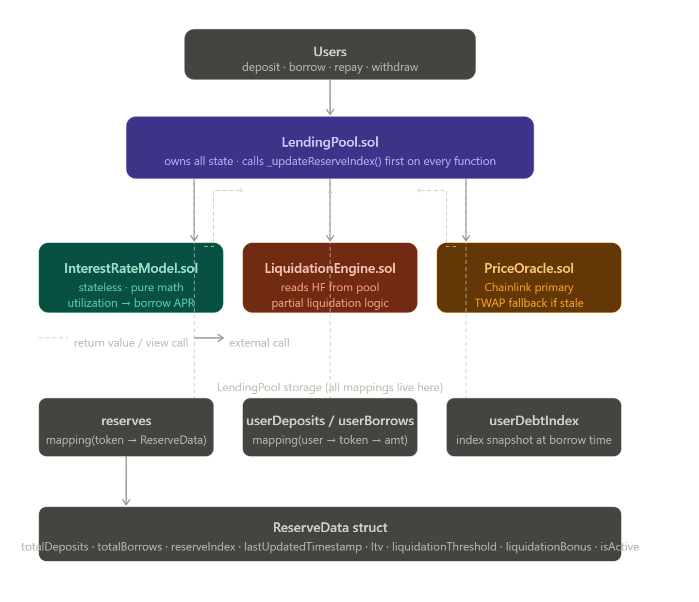

# Lending Protocol

Asimple lending protocol inspired by Aave and Compound, built on the Ethereum blockchain. This protocol allows users to deposit their assets as collateral and borrow against them, as well as earn interest on their deposits.

## Features

- Deposit and withdraw assets- Borrow and repay loans
- Interest rate model based on supply and demand
- Collateral management and liquidation mechanism
- Support for multiple ERC20 tokens

## Architecture

The protocol is designed with a modular architecture, consisting of the following components:

